<div align="center">
  

  <h1>A E T H E R</h1>

**The Autonomous, Cognitively-Aware Personal Intelligence Model**

[](https://github.com/takzen/aether-agent)
[](https://python.org)
[](https://fastapi.tiangolo.com)
[](https://ai.pydantic.dev)
[](https://nextjs.org)
[](https://qdrant.tech)
[](https://modelcontextprotocol.io/)
[](https://www.electronjs.org/)

---

_Aether doesn't wait for commands — it lives, reflects, and anticipates where you do._

</div>

---

## 🌌 What is Aether?

Aether is a **massive paradigm shift** in personal AI computing. It bridges the gap between passive RAG chatbots and truly autonomous, self-reflecting agents. Built upon the principles of an _Active World Model_, Aether is an entirely private, Local-First engine that actively monitors your workflow, connects concepts overnight, and alters its own persona based on the rhythm of your day.

Where traditional AI tools simply react to text, **Aether simulates and anticipates**. Where others suffer from context amnesia, **Aether builds Concept Constellations in Qdrant**. Where others hallucinate, **Aether grounds itself in type-safe Pydantic logic.**

---

## ✨ State-of-the-Art Features

| System / Feature | Description |
| ---------------- | ----------- |
| 🧠 **Active World Model** | Aether runs silent background simulations (`world_model.py`) to reflect on your daily actions, generating overarching insights and proactive architectural suggestions without you asking. |
| 🌙 **Sleep Cycle** | When you log off, the *NightCycleProcessor* consolidates your daily files and logs, reducing noise and preparing a **Morning Brief** for your Dashboard Command Center. |
| ⏱️ **Digital Circadian Rhythm** | Aether dynamically alters its persona based on local system time. *Strategist* in the morning, *Executor* at noon, *Philosopher* in the evening, and *Maintainer* at night. |
| 🕸️ **Concept Constellations** | Moving beyond standard RAG vectors. Aether links memories and facts into a dense relational graph within its core SQLite + Qdrant architecture. |
| 📱 **Telegram Bridge** | Operate your entire codebase and read system briefings via an encrypted, native-feeling CLI bridge straight from the Telegram app on your phone. |
| 🔌 **MCP Server (Model Context Protocol)** | Aether exposes its SQLite Brain via `FastMCP`. Connect your VS Code, Cursor, or Claude Desktop directly to Aether to share its long-term memory with other AIs. |
| 💻 **Electron Desktop App** | A fully native desktop shell wraps the Next.js Dashboard and Python Kernel into a standalone executable environment. |

---

## 🏗️ Architecture Stack

Aether operates as a massive distributed monolith on your local machine, driven by modern package managers (`uv` and `pnpm`).

```mermaid
graph TD
    User["👤 User / Telegram"] <--> HTTP["⚡ FastAPI Kernel"]
    HTTP <--> Agent["🧠 PydanticAI Agent"]
    
    Agent <--> LLM["🤖 Gemini 3 / Local Ollama"]
    Agent <--> Qdrant[("🌌 Qdrant Vector Space")]
    Agent <--> SQLite[("🧠 SQLite Brain (Logs/Sessions)")]
    
    SubAgent1["🌙 Sleep Cycle Processor"] --> SQLite
    SubAgent2["🌍 Active World Model"] --> SQLite
    
    Dashboard["🖥️ Next.js / Electron UI"] <--> HTTP
    MCP_IDE["🔌 Claude/Cursor (via MCP)"] <--> SQLite

    style User fill:#1a1a2e,stroke:#e94560,color:#fff
    style HTTP fill:#16213e,stroke:#0f3460,color:#fff
    style Agent fill:#0f3460,stroke:#e94560,color:#fff
    style LLM fill:#533483,stroke:#e94560,color:#fff
    style Qdrant fill:#16213e,stroke:#3ecf8e,color:#fff
    style SQLite fill:#16213e,stroke:#e2b96f,color:#fff
    style Dashboard fill:#1a1a2e,stroke:#e94560,color:#fff
    style MCP_IDE fill:#4a154b,stroke:#e94560,color:#fff
```



---

## 🛠️ Technology Core

<table>
<tr>
<td><strong>Layer</strong></td>
<td><strong>Technology</strong></td>
</tr>
<tr>
<td>🐍 <strong>Backend Kernel</strong></td>
<td>Python 3.12+, FastAPI, Uvicorn, SQLite3</td>
</tr>
<tr>
<td>🤖 <strong>Cognition Frame</strong></td>
<td>PydanticAI (Type-safe and dependency-injected)</td>
</tr>
<tr>
<td>🖥️ <strong>Command Center</strong></td>
<td>Next.js 16 (App Router), Tailwind CSS, Framer Motion</td>
</tr>
<tr>
<td>💻 <strong>Desktop Shell</strong></td>
<td>Electron, electron-builder</td>
</tr>
<tr>
<td>🗄️ <strong>Vector Memory</strong></td>
<td>Qdrant (Local Docker or Cloud Hybrid)</td>
</tr>
<tr>
<td>🔌 <strong>APIs & Protocol</strong></td>
<td>FastMCP (Anthropic Protocol), python-telegram-bot, Tavily Search</td>
</tr>
</table>

---

## 🚀 One-Click Setup

We have eliminated Docker-hell and requirement-txt conflicts. Aether uses `uv` for lightning-fast Python dependency syncing and `pnpm` for Node.

### Prerequisites

- `curl -LsSf https://astral.sh/uv/install.sh | sh` (UV Python Manager)
- `Node.js 20+` & `npm install -g pnpm`
- A [Qdrant Cloud](https://cloud.qdrant.io/) Cluster (or local instance)
- API Keys for Google Gemini / Tavily / Telegram.

### 1-Click Launch Windows / MacOS

Simply clone the repository and run the installation script. It will setup both backend, frontend, build dependencies, and launch the Electron App:

```bash
# Windows
.\start_desktop.bat

# Linux / Mac 
./setup.sh
```

### Manual Configuration `.env`
Place inside `/backend/.env`:
```env
# AI Models
GEMINI_API_KEY=your_gemini_key
MODEL_OVERRIDE=gemini-3.1-pro-preview

# Vector Storage
QDRANT_API_KEY=your_qdrant_api_key
QDRANT_URL=https://your-cluster.qdrant.io

# Tools & Bridges
TAVILY_API_KEY=your_tavily_api_key
TELEGRAM_BOT_TOKEN=12345:ABCDEF
TELEGRAM_USER_ID=your_id
```

---

## 🔌 Using MCP (Model Context Protocol)

Aether isn't selfish with its memory. You can expose Aether's internal SQLite Brain and Morning Briefs directly to your IDE (like Cursor or Claude).
Add the following to your `claude_desktop_config.json`:

```json
"mcpServers": {
  "aether-core": {
    "command": "uv",
    "args": ["run", "python", "backend/mcp_server.py"]
  }
}
```

---

## 🐳 Docker Compose (Self-Hosting)

For NAS or VPS enthusiasts, Aether ships with an incredibly lightweight, production-ready `docker-compose.yml`.
The frontend compiles to a Standalone Node instance, and the backend runs on Alpine Slim. Volume mounts persist your digital memories forever.

```bash
docker-compose up -d --build
```

---

## 📝 Roadmap & Philosophy

> _"Aether aims to be more than just a software tool — it's an intelligent entity aware of its existence in time and space."_

Aether is almost feature-complete based on our original 6-Phase Master Plan (37/38 Tasks Done). 
The final frontier is purely packing this immense ecosystem into a single `AetherCore.exe` installer using PyInstaller and NSIS.

---

## 📝 License

**MIT** © [Krzysztof Pika](https://github.com/takzen)

<div align="center">
<br>

_"This is my small contribution to the development of local AI. It is a humble beginning of a concept that will soon evolve into something much greater. If you want to witness the transformation, follow my next steps."_

</div>
