<div align="center">

```
 █████╗ ███████╗████████╗██╗  ██╗███████╗██████╗
██╔══██╗██╔════╝╚══██╔══╝██║  ██║██╔════╝██╔══██╗
███████║█████╗     ██║   ███████║█████╗  ██████╔╝
██╔══██║██╔══╝     ██║   ██╔══██║██╔══╝  ██╔══██╗
██║  ██║███████╗   ██║   ██║  ██║███████╗██║  ██║
╚═╝  ╚═╝╚══════╝   ╚═╝   ╚═╝  ╚═╝╚══════╝╚═╝  ╚═╝
```

**The Proactive, Type-Safe Personal Intelligence Layer**

[](https://python.org)
[](https://fastapi.tiangolo.com)
[](https://ai.pydantic.dev)
[](https://nextjs.org)
[](https://supabase.com)
[](LICENSE)

---

_Aether doesn't wait for commands — it lives where you do._

</div>

---

## 🌌 What is Aether?

Aether is a **next-generation personal AI assistant** that bridges the gap between passive chatbots and truly autonomous agents. Inspired by the vision of _Jarvis_, Aether combines structured reasoning, long-term memory, and proactive communication to become a **digital extension of yourself**.

Where traditional AI tools react, **Aether anticipates**. Where others forget, **Aether remembers**. Where others hallucinate, **Aether validates**.

---

## ✨ Key Features

| Feature                        | Description                                                                                                         |
| ------------------------------ | ------------------------------------------------------------------------------------------------------------------- |
| 🤖 **Agentic Core**            | Powered by **PydanticAI** — every tool call and model response is validated, structured, and reliable               |
| 🧠 **Hybrid Intelligence**     | Switch between **Gemini 3 Flash, Pro** for cloud reasoning and **Llama 3 via Ollama** for local, private inference  |
| 🗄️ **Infinite Memory**         | **Supabase Vector (pgvector)** stores long-term context, documents, and conversation history — nothing is forgotten |
| ⚡ **Proactive Notifications** | Aether _initiates_ conversations via **Telegram / Discord / WhatsApp** for briefings, reminders, and urgent alerts  |
| 🛠️ **Extensible Toolbelt**     | Built-in tools: file management, **Tavily** web search, calendar integration, terminal execution                    |
| 🖥️ **Command Center**          | A sleek **Next.js 16** dashboard to monitor agent thought processes, manage knowledge, and configure settings       |

---

## 🏗️ Architecture

```mermaid
graph TD
    User["👤 User / Telegram"] <--> API["⚡ FastAPI Gateway"]
    API <--> Agent["🧠 PydanticAI Agent"]
    Agent <--> LLM["🤖 Gemini / Llama 3"]
    Agent <--> DB[("🗄️ Supabase + pgvector")]
    Agent <--> Tools["🛠️ Local Tools / Web Search"]
    Dashboard["🖥️ Next.js Dashboard"] <--> API

    style User fill:#1a1a2e,stroke:#e94560,color:#fff
    style API fill:#16213e,stroke:#0f3460,color:#fff
    style Agent fill:#0f3460,stroke:#e94560,color:#fff
    style LLM fill:#533483,stroke:#e94560,color:#fff
    style DB fill:#16213e,stroke:#3ecf8e,color:#fff
    style Tools fill:#16213e,stroke:#e2b96f,color:#fff
    style Dashboard fill:#1a1a2e,stroke:#e94560,color:#fff
```



---

## 🛠️ Tech Stack

<table>
<tr>
<td><strong>Layer</strong></td>
<td><strong>Technology</strong></td>
</tr>
<tr>
<td>🐍 Backend</td>
<td>Python 3.12+, FastAPI</td>
</tr>
<tr>
<td>🤖 Agent Framework</td>
<td>PydanticAI — model-agnostic, fully type-safe</td>
</tr>
<tr>
<td>🖥️ Frontend</td>
<td>Next.js 16 (App Router), Tailwind CSS, shadcn/ui</td>
</tr>
<tr>
<td>🗄️ Database & Auth</td>
<td>Supabase (PostgreSQL + pgvector)</td>
</tr>
<tr>
<td>🧠 LLM Providers</td>
<td>Google Gemini API, Ollama (local), OpenAI</td>
</tr>
<tr>
<td>📡 Communication</td>
<td>Telegram Bot API / Webhooks</td>
</tr>
</table>

---

## 🚀 Getting Started

### Prerequisites

- Python `3.12+`
- Node.js `18+`
- A [Supabase](https://supabase.com) project with `pgvector` enabled
- A [Gemini API](https://aistudio.google.com) key or a local [Ollama](https://ollama.ai) instance
- A [Telegram Bot Token](https://t.me/BotFather)

### Configuration

```bash
# Copy the example environment file
cp .env.example .env
```

Fill in your credentials in `.env`:

```env
# LLM
GEMINI_API_KEY=your_gemini_api_key
OLLAMA_BASE_URL=http://localhost:11434   # optional

# Database
SUPABASE_URL=https://your-project.supabase.co
SUPABASE_KEY=your_supabase_anon_key

# Communication
TELEGRAM_BOT_TOKEN=your_telegram_bot_token

# Web Search
TAVILY_API_KEY=your_tavily_api_key
```

### Run

```bash
# Start backend
cd backend
uv run python main.py

# Start frontend
cd frontend
pnpm dev

```

## 🧠 Philosophy

> _"Aether aims to be more than just a software tool — it's a digital extension of yourself."_

By combining **Structured Outputs** with **Long-term Memory**, Aether minimizes hallucinations and maximizes utility. The goal is simple: **automate the mundane, and focus on what matters.**

The key architectural bets:

- **Type-safety over chaos** — PydanticAI ensures every agent interaction is validated. No silent failures.
- **Memory over context windows** — Conversations, documents, and preferences are persisted in vector storage. Aether remembers.
- **Proactivity over passivity** — A true assistant doesn't wait to be asked. Aether reaches out.

---

## 🤝 Contributing

Contributions, issues, and feature requests are welcome! Feel free to open an issue or submit a pull request.

1. Fork the repository
2. Create your feature branch (`git checkout -b feature/amazing-feature`)
3. Commit your changes (`git commit -m 'feat: add amazing feature'`)
4. Push to the branch (`git push origin feature/amazing-feature`)
5. Open a Pull Request

---

## 📝 License

**MIT** © [Krzysztof Pika](https://github.com/takzen)

---

<div align="center">

_Built with obsession. Designed for autonomy._

⭐ **Star this repo** if Aether resonates with your vision of the future.

</div>
