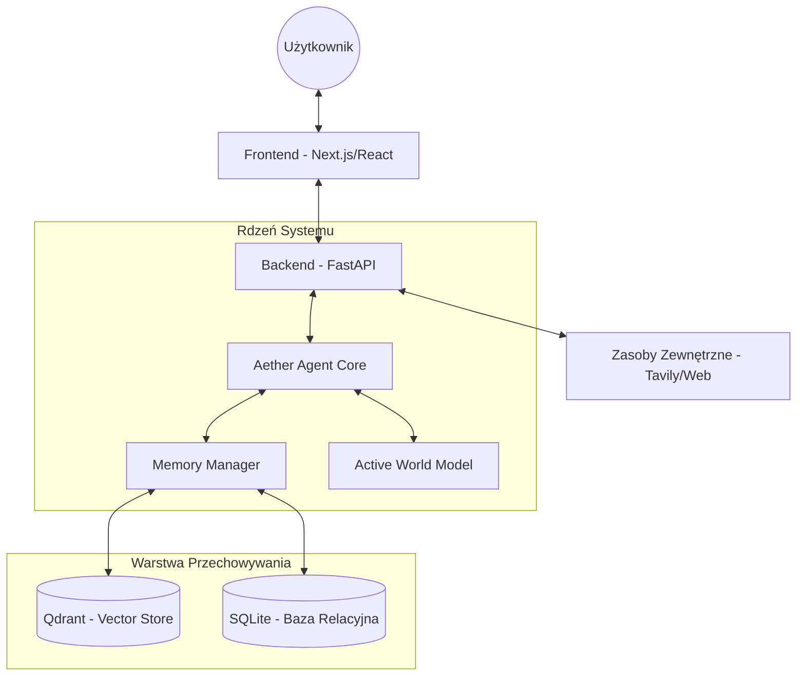

# Architektura Systemu Aether

Aether Agent został zaprojektowany w architekturze **Hybrid Intelligence Protocol (HIP)**, łącząc nowoczesne modele językowe (LLM) z własnym wirtualnym modelem świata i wielowarstwową pamięcią.

## Schemat Wysokopoziomowy

## Główne Komponenty

### 1. Backend (FastAPI)
- **Narzędzia (Tooling):** Implementacja Model Context Protocol (MCP) dla narzędzi systemowych (Pliki, Web Search, Baza Danych).
- **Komunikacja:** System HITL (Human-in-the-Loop) dla operacji krytycznych, takich jak automatyczny zapis plików.
- **Strumieniowanie:** Obsługa Thought Stream (strumienia myśli) i generowanie finalnych odpowiedzi w czasie rzeczywistym.

### 2. Frontend (Next.js)
- **Dashboard:** "Centrum Dowodzenia" (Command Center) z terminalem obsługującym Slash Commands.
- **Estetyka (Aesthetics):** Styl klasy Premium (Dark Mode, Glassmorphism, animacje framer-motion).
- **Wizualizacja:** Interaktywne widoki topologii wiedzy (Neural Topology) i pamięci semantycznej.

### 3. Warstwa Pamięci (Neural Core)
- **Pamięć Wektorowa (Qdrant):** Przechowuje semantyczne "wspomnienia" Agenta i zaindeksowane dokumenty Bazy Wiedzy.
- **Pamięć Relacyjna (SQLite):** Przechowuje logi systemowe, historię wszystkich sesji oraz "Concept Constellation" (graf powiązań między pojęciami).

---
*Ostatnia aktualizacja architektury: 2026-02-28*
