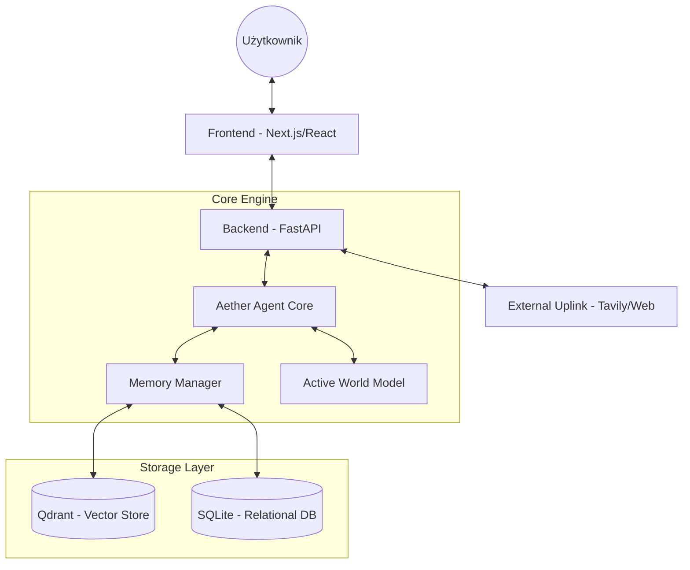

# Architektura Systemu Aether

Aether Agent został zaprojektowany w architekturze **Hybrid Intelligence Protocol (HIP)**, łącząc modele językowe (LLM) z własnym modelem świata i wielowarstwową pamięcią.

## Schemat Wysokopoziomowy

## Główne Komponenty

### 1. Backend (FastAPI)
- **Tooling:** Implementacja Model Context Protocol (MCP) dla narzędzi (Filesystem, Web Search, Database).
- **Communication:** System HITL (Human-in-the-Loop) dla operacji krytycznych (zapis plików).
- **Streaming:** Obsługa Thought Stream i finalnej odpowiedzi.

### 2. Frontend (Next.js)
- **Dashboard:** "Command Center" z terminalem obsługującym Slash Commands.
- **Aesthetics:** Styl Premium (Dark Mode, Glassmorphism, framer-motion).
- **Visualization:** Interaktywne widoki grafu wiedzy (Neural Topology).

### 3. Warstwa Pamięci (Neural Core)
- **Vector Memory (Qdrant):** Przechowuje semantyczne wspomnienia i zaindeksowane dokumenty.
- **Relational Memory (SQLite):** Przechowuje logi systemowe, historię sesji oraz "Concept Constellation" (graf powiązań).

---
*Ostatnia aktualizacja: 2026-02-27*
