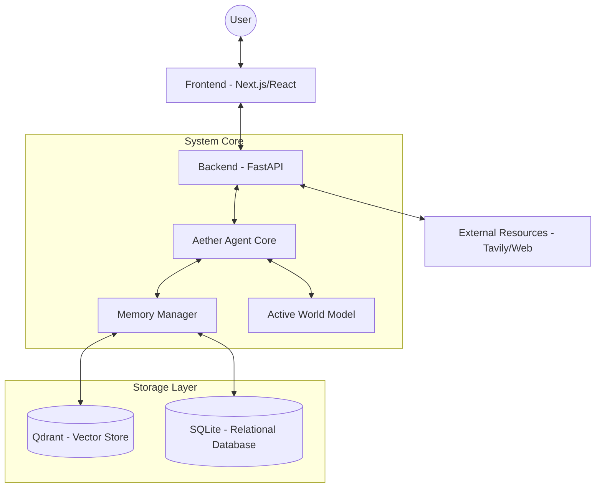

# Aether System Architecture

Aether Agent was designed with the **Hybrid Intelligence Protocol (HIP)** architecture, combining modern language models (LLM) with its own virtual world model and multi-layered memory.

## High-Level Diagram

## Main Components

### 1. Backend (FastAPI)
- **Tooling:** Implementation of the Model Context Protocol (MCP) for system tools (Files, Web Search, Database).
- **Communication:** HITL (Human-in-the-Loop) system for critical operations, such as automatic file saving.
- **Streaming:** Support for Thought Stream and generation of final responses in real-time.

### 2. Frontend (Next.js)
- **Dashboard:** "Command Center" with a terminal supporting Slash Commands.
- **Aesthetics:** Premium class style (Dark Mode, Glassmorphism, framer-motion animations).
- **Visualization:** Interactive views of knowledge topology (Neural Topology) and semantic memory.

### 3. Memory Layer (Neural Core)
- **Vector Memory (Qdrant):** Stores Agent's semantic "memories" and indexed Knowledge Base documents.
- **Relational Memory (SQLite):** Stores system logs, history of all sessions, and "Concept Constellation" (graph of connections between concepts).

---
*Last architecture update: 2026-02-28*